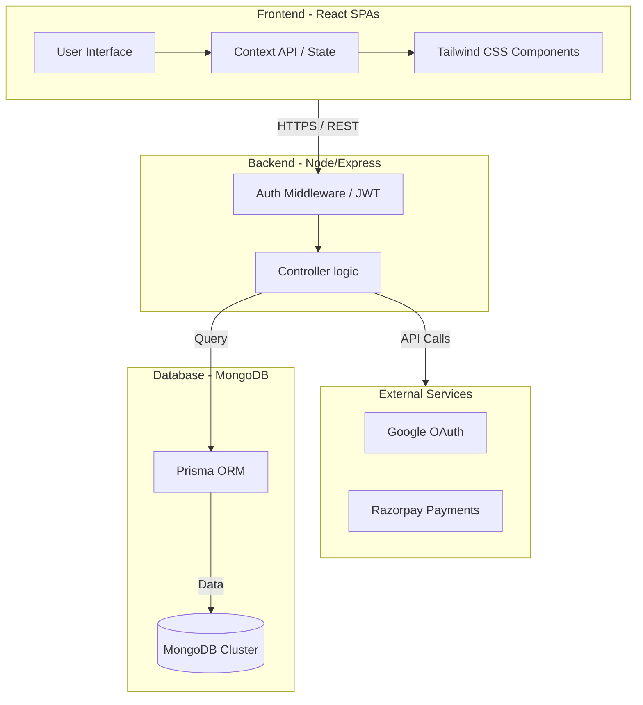
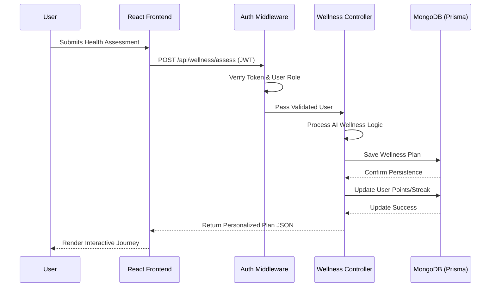

# CureWise - Holistic Wellness & Healing Platform

CureWise is a comprehensive health and wellness ecosystem designed to bridge the gap between traditional medicine and holistic healing. It empowers users with AI-driven personalized wellness plans, a vibrant community support system, and direct access to medical experts.

## 🌟 Key Features

- **Healing Vault (Success Stories)**: A protected sanctuary where community members share their intimate transformation journeys. Access is restricted to authenticated users to maintain privacy and trust.
- **Community Hub**: An interactive platform for health discussions, peer support, and verified resource sharing.
- **AI-Powered Wellness Plans**: Personalized health assessments that generate dynamic wellness plans based on holistic and natural principles.
- **Doctor Consultation**: Seamless booking system for specialized consultations, including support for video meetings.
- **Emergency Care**: High-priority ambulance booking system with real-time status tracking for critical situations.
- **Remedy Database**: A vast, searchable library of natural remedies and disease mapping to empower self-care.
- **Holistic Health Tools**: Integrated BMI calculator, water intake tracker, and evidence-based health risk assessment quizzes.
- **Zen Space**: Dedicated yoga and meditation modules, including a "Zen Space Finder" to locate nearby studios.
- **Gamified Reputation**: A motivation engine that rewards users with points, daily streaks, and tiered badges for maintaining healthy habits.

---

## 🏗️ System Design

### Architecture Overview

CureWise follows a modern **three-tier architecture** optimized for horizontal scalability and high user engagement.



### Components Detail

- **Frontend**: Built with **React** and **Vite**, prioritizing "Rich Aesthetics" and "Visual Excellence". It uses the Context API to maintain a synchronized state of user points, streaks, and wellness progress across all segments.
- **Backend**: A robust **Node.js/Express** server (JavaScript) that handles business logic, gamification calculations (streaks/badges), and secure data orchestration.
- **Database**: **MongoDB** is utilized for its flexible document-oriented structure, ideal for storing nested wellness plans, rich community posts, and varied user interactions.
- **Security**: Implements a zero-trust approach for community data. All community and wellness endpoints are protected via JWT-based authentication and granular role-based access control (RBAC).

### Core Interaction Flow

The following sequence diagram illustrates the flow of a typical user request, such as generating a Personalized Wellness Plan:



---

## 🛠️ Tech Stack

- **Frontend**: React 18, Tailwind CSS, Lucide Icons, Axios, React Router.
- **Backend**: Node.js, Express.js (ESM), Prisma ORM.
- **Database**: MongoDB (Altas).
- **Auth**: JWT, bcryptjs, google-auth-library.
- **Integrations**: Razorpay (Payments).

---

## 📂 Folder Structure & File Functionality

### 💻 Frontend (`/frontend`)

| Directory / File | Functionality |
| :--- | :--- |
| **`src/pages/`** | **Core Application Views** |
| `HomePage.jsx` | Landing page with featured services and high-fidelity hero section. |
| `Profile.jsx` | Dynamic user dashboard showing wellness progress, history, and live awards. |
| `CommunityHub.jsx` | Interactive forum for health discussions, peer support, and verified sharing. |
| `SuccessStories.jsx` | A curated gallery of shared healing journeys (The Healing Vault). |
| `AmbulanceBooking.jsx`| Emergency transport request system with real-time tracking and dispatch. |
| `DoctorBooking.jsx` | Multi-step booking flow for consultations with holistic medical experts. |
| `WellnessPlans.jsx` | AI-driven health assessment engine and personalized plan visualizer. |
| `RemedyDatabase.jsx` | Searchable library of natural cures, herbal remedies, and disease mapping. |
| `YogaCentreFinder.jsx`| Geo-location based finder for nearby yoga, meditation, and wellness studios. |
| `SymptomChecker.jsx` | Interactive diagnostic tool for preliminary health risk assessments. |
| **`src/context/`** | **Global State & Logic** |
| `AuthContext.jsx` | Manages secure sessions, JWT persistence, and Google OAuth integration. |
| `UserDataContext.jsx` | Centralized engine for points, streaks, badges, and live history sync. |
| **`src/api/`** | **Data Communication** |
| `index.js` | Configured Axios instance with intercepted auth headers for secure API calls. |

### ⚙️ Backend (`/backend`)

| Directory / File | Functionality |
| :--- | :--- |
| **`src/controllers/`**| **Core Business Intelligence** |
| `auth.controller.js` | Logic for secure registration, login, and tiered profile synchronization. |
| `ambulance.controller.js`| Manages the full emergency request lifecycle (request, dispatch, deletion). |
| `doctor.controller.js` | Orchestrates appointment scheduling, payment validation, and history management. |
| `community.controller.js`| Handles forum interactions, nested comments, and "Healing Vault" permissions. |
| `wellness.controller.js`| Processes complex health assessments to generate personalized recovery paths. |
| **`src/routes/`** | **API Microservices** |
| `auth.routes.js` | Endpoints for identity management and profile updates. |
| `ambulance.routes.js` | Secured routes for high-priority emergency transport services. |
| `community.routes.js` | Data flows for story sharing, discussions, and engagement tracking. |
| **`src/middleware/`** | **Security Layer** |
| `auth.middleware.js` | JWT validation engine with Role-Based Access Control (RBAC) enforcement. |
| **`prisma/`** | **Database Architecture** |
| `schema.prisma` | Unified data model defining users, bookings, stories, and gamification schema. |
| `seed.js` | Automated script to populate the environment with initial holistic data. |

---

## 🚀 Getting Started

### Prerequisites
- Node.js (v18 or higher)
- A running MongoDB instance (or Atlas cluster)
- Environment variables: `DATABASE_URL`, `JWT_SECRET`, `GOOGLE_CLIENT_ID`.

### Installation

1.  **Clone the Repository**
    ```bash
    git clone https://github.com/Vikash9546/CureWise.git
    cd CureWise
    ```

2.  **Backend Configuration**
    ```bash
    cd backend
    npm install
    npx prisma generate
    npm run dev
    ```

3.  **Frontend Configuration**
    ```bash
    cd frontend
    npm install
    npm run dev
    ```

### Seed Data
To populate the database with initial natural remedies and expert doctors:
```bash
# Inside backend directory
node src/seed.js
node src/seed-natural-doctors.js
```

---

