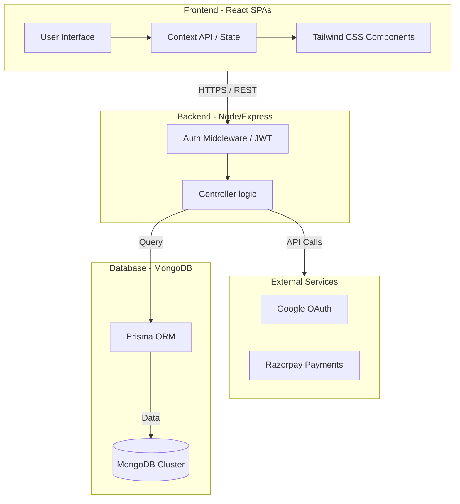

# CureWise - Holistic Wellness & Healing Platform

CureWise is a comprehensive health and wellness ecosystem designed to bridge the gap between traditional medicine and holistic healing. It empowers users with AI-driven personalized wellness plans, a vibrant community support system, and direct access to medical experts.

## 🌟 Key Features

- **Healing Vault (Success Stories)**: A protected sanctuary where community members share their intimate transformation journeys. Access is restricted to authenticated users to maintain privacy and trust.
- **Community Hub**: An interactive platform for health discussions, peer support, and verified resource sharing.
- **AI-Powered Wellness Plans**: Personalized health assessments that generate dynamic wellness plans based on holistic and natural principles.
- **Doctor Consultation**: Seamless booking system for specialized consultations, including support for video meetings.
- **Emergency Care**: High-priority ambulance booking system with real-time status tracking for critical situations.
- **Remedy Database**: A vast, searchable library of natural remedies and disease mapping to empower self-care.
- **Holistic Health Tools**: Integrated BMI calculator, water intake tracker, and evidence-based health risk assessment quizzes.
- **Zen Space**: Dedicated yoga and meditation modules, including a "Zen Space Finder" to locate nearby studios.
- **Gamified Reputation**: A motivation engine that rewards users with points, daily streaks, and tiered badges for maintaining healthy habits.

---

## 🏗️ System Design

### Architecture Overview

CureWise follows a modern **three-tier architecture** optimized for horizontal scalability and high user engagement.



### Components Detail

- **Frontend**: Built with **React** and **Vite**, prioritizing "Rich Aesthetics" and "Visual Excellence". It uses the Context API to maintain a synchronized state of user points, streaks, and wellness progress across all segments.
- **Backend**: A robust **Node.js/Express** server (JavaScript) that handles business logic, gamification calculations (streaks/badges), and secure data orchestration.
- **Database**: **MongoDB** is utilized for its flexible document-oriented structure, ideal for storing nested wellness plans, rich community posts, and varied user interactions.
- **Security**: Implements a zero-trust approach for community data. All community and wellness endpoints are protected via JWT-based authentication and granular role-based access control (RBAC).

---

## 🛠️ Tech Stack

- **Frontend**: React 18, Tailwind CSS, Lucide Icons, Axios, React Router.
- **Backend**: Node.js, Express.js (ESM), Prisma ORM.
- **Database**: MongoDB (Altas).
- **Auth**: JWT, bcryptjs, google-auth-library.
- **Integrations**: Razorpay (Payments).

---

## 🚀 Getting Started

### Prerequisites
- Node.js (v18 or higher)
- A running MongoDB instance (or Atlas cluster)
- Environment variables: `DATABASE_URL`, `JWT_SECRET`, `GOOGLE_CLIENT_ID`.

### Installation

1.  **Clone the Repository**
    ```bash
    git clone https://github.com/Vikash9546/CureWise.git
    cd CureWise
    ```

2.  **Backend Configuration**
    ```bash
    cd backend
    npm install
    npx prisma generate
    npm run dev
    ```

3.  **Frontend Configuration**
    ```bash
    cd frontend
    npm install
    npm run dev
    ```

### Seed Data
To populate the database with initial natural remedies and expert doctors:
```bash
# Inside backend directory
node src/seed.js
node src/seed-natural-doctors.js
```

---

